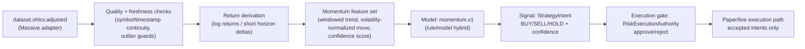

# Tier-0 Lineage: `momentum.v1`

- **strategy_key:** `momentum.v1`
- **tier:** Tier-0
- **owner:** Live Inference + Risk/Execution On-call
- **last_verified_date (UTC):** 2026-05-01

## 1) Source dataset → transformations → features → model → signal → execution

## 2) Contract mapping details

| Stage | Mapping |
|---|---|
| Source dataset | `dataset.ohlcv.adjusted` (Tier-0 market data baseline), with derived `ohlcv.close` as direct pricing input where required. |
| Transformations | Canonical market-data normalization, continuity checks, and short-horizon return derivation for momentum scoring. |
| Features | Trend direction over recent windows, normalized move magnitude, and confidence proxy. |
| Model | `momentum.v1` strategy logic emitted by live inference service as `StrategyIntent`. |
| Signal | Intent payload includes side, quantity, confidence, and rationale reference. |
| Execution | Risk/execution authority consumes intent, applies policy gates, and only approved intents continue to execution handling. |

## 3) Runtime/component anchors

- Signal producer anchor: `service_inference_live.main` mock/live intent builder sets `strategy_key="momentum.v1"`.
- Signal contract anchor: `gb_core.schemas.StrategyIntent`.
- Execution gate anchor: `service_risk_exec.main.consume_strategy_intent(...)`.

## 4) Verification notes

- Verified lineage doc creation and anchor consistency on 2026-05-01.
- Update required whenever strategy features, intent schema, risk gate policy, or execution adapter contract changes.
